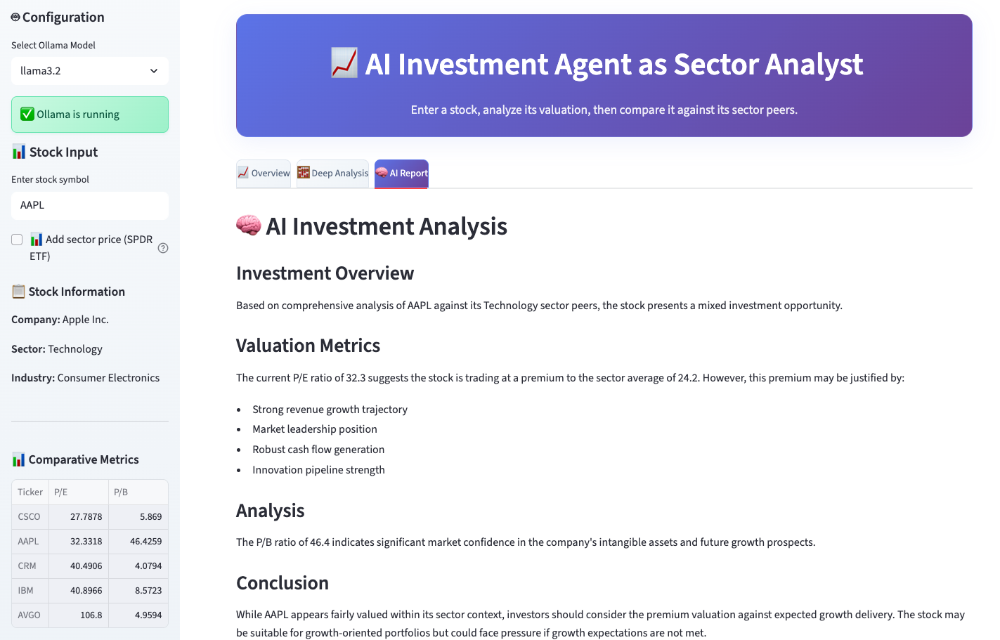

# 🤖 AI Investment Agent - Open Source Edition

> ⚠️ **DISCLAIMER**: This application is for educational and research purposes only. The analysis and recommendations provided do not constitute financial advice. Always conduct your own research and consult with qualified financial professionals before making investment decisions.

A completely open-source AI-powered investment analysis tool that uses local Ollama models to analyze stock valuations and compare them against sector peers.



*The AI Investment Agent interface showing comprehensive stock analysis with sector comparisons and AI-generated insights.*

## 🧠 Agentive AI Characteristics

This application embodies **agentive AI** through autonomous decision-making capabilities and goal-oriented behavior. The system uses the **Agno (v1.7.0)** framework to create an intelligent agent characterized by:

**🤖 Autonomous Analysis**: The agent independently analyzes stock valuations by automatically detecting sectors, fetching peer data, and calculating comparative metrics without human intervention for each step.

**🔧 Tool Integration**: It leverages multiple specialized tools (**YFinance v0.2.63** for real-time data, **Ollama v0.5.1** for local AI reasoning) to gather information and generate insights, demonstrating the agent's ability to orchestrate complex workflows.

**🎯 Goal-Directed Behavior**: The agent operates with clear objectives - comparing stocks against sector peers, identifying valuation discrepancies, and providing investment analysis - executing these tasks systematically through structured prompts and instructions.

**🧮 Adaptive Reasoning**: Using local **Ollama v0.5.1** models, the agent processes financial data contextually, generating detailed 800+ word analyses that explain valuation metrics and provide conclusions about whether stocks are overvalued or undervalued.

**📊 Proactive Information Gathering**: The agent doesn't just respond to queries but proactively identifies relevant sector ETFs, fetches constituent data using **YFinance v0.2.63**, and performs comprehensive peer comparisons with **Pandas v2.3.0** data processing to provide actionable investment insights through the **Streamlit v1.46.1** interface.

## ✨ Features

- **Local AI Processing**: Uses Ollama models running locally
- **Sector Analysis**: Automatically detects stock sectors and compares against peers
- **Valuation Metrics**: P/E, P/B, PEG ratios and more
- **Real-time Data**: Live stock data via Yahoo Finance
- **Interactive Charts**: Beautiful Plotly visualizations with sector ETF comparisons
- **AI-Generated Descriptions**: Dynamic company overviews using selected Ollama models
- **Enhanced UI**: Professional gradient design with tabs and sidebar
- **Sector ETF Integration**: Optional SPDR ETF price comparison
- **No API Keys Required**: Completely free and open source

---

<p><strong>Disclaimer:</strong> This application is for educational purposes only and does not constitute financial advice. The analysis and recommendations provided should not be considered as investment guidance. Always conduct your own research and consult with qualified financial professionals before making investment decisions.</p>

---

## 📚 Definitions

- **P/E (Price-to-Earnings)**: Ratio of stock price to earnings per share, indicating how much investors pay for each dollar of earnings
- **P/B (Price-to-Book)**: Ratio comparing market price to book value per share, useful for valuing asset-heavy companies
- **PEG (Price/Earnings-to-Growth)**: P/E ratio divided by earnings growth rate, showing if growth justifies valuation
- **EV/EBITDA**: Enterprise Value to EBITDA, measures total company value relative to earnings before expenses


---

## 🚀 Get Started

### 1. Install Ollama

First, install Ollama on your system:

**macOS:**
```bash
curl -fsSL https://ollama.ai/install.sh | sh
```

**Linux:**
```bash
curl -fsSL https://ollama.ai/install.sh | sh
```

**Windows:**
Download from [ollama.ai](https://ollama.ai/download)

### 2. Pull a Model

Pull one of the supported models:

```bash
# Option 1: Llama 3.2 (recommended)
ollama pull llama3.2

# Option 2: Mistral (faster, smaller)
ollama pull mistral

# Option 3: Code Llama (good for analysis)
ollama pull codellama
```

### 3. Install Python Dependencies

**Option A: Using pip (recommended)**
```bash
pip install -r requirements.txt
```

**Option B: Using conda (alternative)**
```bash
# Create a new conda environment
conda create -n ai-stock-picker python=3.11

# Activate the environment
conda activate ai-stock-picker

# Install dependencies
pip install -r requirements.txt
```

**Note**: You can also use conda to install some packages, but pip is recommended for this project as some packages are only available via pip.

### 4. Start Ollama

In a terminal, start the Ollama service:

```bash
ollama serve
```

### 5. Run the Application

In another terminal:

```bash
streamlit run app.py
```

## 📊 How to Use

1. **Select Model**: Choose from available Ollama models (llama3.2, mistral, codellama, etc.)
2. **Enter Stock Symbol**: Type a stock symbol (e.g., AAPL, MSFT, TSLA)
3. **Configure Options**: 
   - Enable sector ETF comparison (optional)
   - Check Ollama connection status
4. **View Analysis**: The app provides three tabs:
   - **Overview**: Key metrics, AI-generated company description, and price charts
   - **Deep Analysis**: Sector-wide comparisons and valuation charts
   - **AI Report**: Investment analysis and recommendations

## 🧠 Supported Models

- **llama3.2**: Best overall performance (recommended)
- **llama3.1**: Good balance of speed and quality
- **mistral**: Fast and efficient
- **codellama**: Good for analytical tasks
- **qwen2.5**: Alternative option

## 🔧 Troubleshooting

### Ollama Connection Issues

If you see "Cannot connect to Ollama":
1. Ensure Ollama is installed: `ollama --version`
2. Start the service: `ollama serve`
3. Check if it's running: `curl http://localhost:11434/api/tags`

### Model Not Found

If you get a model error:
1. Pull the model: `ollama pull llama3.2`
2. List available models: `ollama list`

### Performance Tips

- Use `mistral` for faster responses
- Use `llama3.2` for better analysis quality
- Ensure you have sufficient RAM (8GB+ recommended)

## 🏗️ Architecture

- **Frontend**: Streamlit web interface with Plotly charts
- **AI Engine**: Ollama with local models for company descriptions
- **Data Source**: Yahoo Finance via yfinance
- **Analysis**: Sector-based peer comparison with SPDR ETFs
- **Utilities**: Enhanced sector mapping and ETF holdings management

## 📁 Project Structure

```
ai_agent_stock_picker/
├── app.py                 # Main Streamlit application
├── utils.py               # Utility functions for sector mapping and data fetching
├── script_get_symbols.py  # Script to fetch and update ETF holdings data
├── test_sector_debug.py   # Debug script for testing sector matching
├── requirements.txt       # Python dependencies
└── README.md             # This file
```

## 🔧 Additional Tools

### Updating ETF Holdings Data

To update the sector ETF holdings data:

```bash
python script_get_symbols.py
```

This will create a `ticker_symbols/` directory with updated holdings data.

### Testing Sector Matching

To test the sector ETF matching functionality:

```bash
python test_sector_debug.py
```

This helps debug sector detection issues with specific stocks.

## 📈 Example Output

The app provides:
- Stock sector identification
- Valuation metrics comparison
- AI-generated investment analysis
- Peer comparison tables


